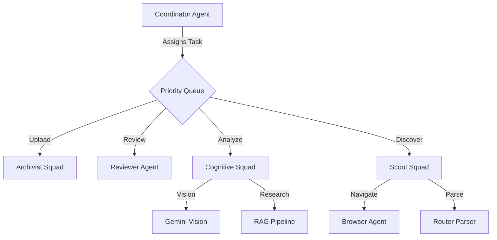

<div align="center">

# 🏛️ Museum Curator Agent
### The Autonomous AI Archivist
**Preserve. Analyze. Immortalize.**

[](https://www.python.org/downloads/)
[](LICENSE)
[](https://github.com/google-gemini/agent-development-kit)
[](https://deepmind.google/technologies/gemini/)
[](https://dublincore.org/)

[Live Dataset (Hugging Face)](https://huggingface.co/datasets/nwokikeonyeka/igbo-museum-archive) • [Architecture](#-architecture) • [Deploy](#-deployment)

</div>

---

## 🚀 What is this?

The **Museum Curator Agent** is a cloud-native, multi-agent system designed to reclaim digital heritage. Unlike simple scrapers, it uses **Cognitive RAG (Retrieval Augmented Generation)** to "see" artifacts, research their history, and write scholarly abstracts without hallucination.

**Why this architecture?**
The system moves beyond linear scripts to a **Coordinator-Dispatcher** model. It features:
* **Dynamic Navigation:** Browses complex AJAX museum sites like a human (clicking "Next", handling sessions).
* **Multi-View Vision:** Captures every angle of an artifact (Front, Back, Detail), not just the thumbnail.
* **Fact-Checked History:** A 3-stage RAG pipeline (Search -> Extract -> Synthesize) ensures historical accuracy.

## ✨ Key Features

| Feature | Tech Stack | Description |
| :--- | :--- | :--- |
| **Cognitive Vision** | **Gemini 3 Flash** | Analyzes image condition, materials, and iconography. |
| **Historical RAG** | **DuckDuckGo + Gemini** | Cross-references museum metadata with global history. |
| **Standardized Data** | **Postgres (Neon)** | Stores metadata in **Dublin Core** format (compatible with Europeana). |
| **Public Archival** | **Hugging Face Hub** | Automatically uploads cleaned datasets for public research. |
| **Ops Control** | **Telegram Bot** | Start, stop, and review drafts from your phone. |

## 🏗️ Architecture: The "Squad" System

The system is controlled by a central **Coordinator Agent** that dispatches tasks to specialized squads based on real-time queue metrics.



### The Squads

1. **Scout Squad:** Handles browser automation, dynamic pagination, and robust HTML parsing.
2. **Cognitive Squad:** Runs the RAG pipeline. It reads search results, filters for verified quotes, and synthesizes a cited description.
3. **Archivist Squad:** Manages data integrity, cleaning, and uploading to Hugging Face.

## ⚡ Quick Start

### Prerequisites

* Python 3.10+
* **Neon** (Postgres) Database URL
* **Hugging Face** Write Token
* **Telegram** Bot Token

### Installation

```bash
# 1. Clone the repo
git clone [https://github.com/Nwokike/museum-curator-agent.git](https://github.com/Nwokike/museum-curator-agent.git)
cd museum-curator-agent

# 2. Install dependencies
pip install -r requirements.txt
playwright install chromium

# 3. Configure Environment
cp .env.template .env
# (Fill in your API keys)

```

### Running the Agent

```bash
# Run the Telegram Bot Listener
python bot.py

# In Telegram, send: /run

```

## 📊 Data Schema (Dublin Core)

We strictly adhere to archival standards to ensure interoperability.

* `spatial_coverage`: Geographic origin (e.g., "Anambra, Nigeria")
* `temporal_coverage`: Date of creation (e.g., "Circa 1904")
* `subject`: Cultural category (e.g., "Mask; Ritual Object")
* `rights_holder`: Owning institution.

## 🤝 Contributing

We welcome contributions! Please read `llms.txt` to understand the codebase structure before submitting a PR.

## 🔄 Changelog (Self-Healing Update)

*   **Fixed Startup Crash**: Resolved `Pydantic` validation errors in agent instantiation.
*   **Session Management**: Implemented auto-creation of sessions to prevent `Session not found` errors.
*   **Tool Robustness**: Added dummy arguments to `get_queue_metrics` to fix `litellm` tool calling failures with Llama 3 models.
*   **Network Stability**: Increased Telegram timeouts (`read_timeout=30s`, `connect_timeout=30s`) to handle poor connectivity gracefully.

## 📄 License

BSD 3-Clause License. See [LICENSE](https://www.google.com/search?q=LICENSE) for details.
```